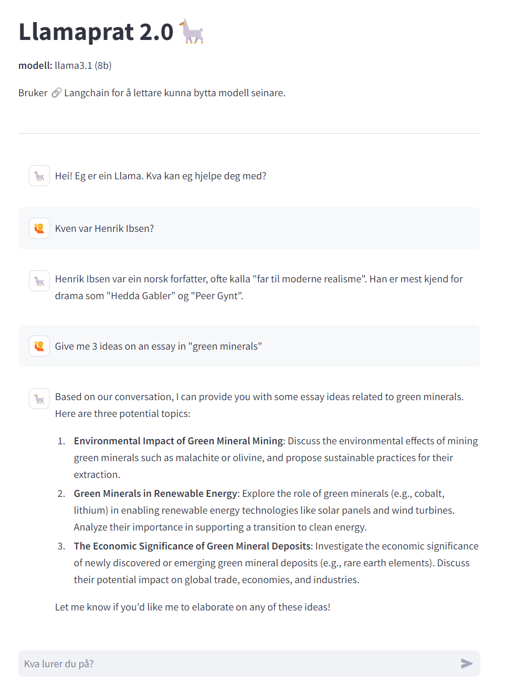
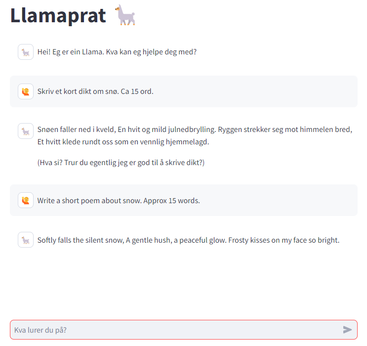

# lokal-ai-app

Tester litt python, KI og ollama. 

## llama-app-v2.py 
er med langchain, for å enklare kunne legge til fleire modellar. Inkluderer strøyming av svar.



## llama-app.py
er utan langchain, og har ikkje strøyming av svar.



### Python - requirements

For å installera biblioteka i python (gjerne i eit conda env) kan du køyra


```bash
pip install -r requirements.txt
```

## Du treng
- **[ollama](ollama.ai)** for å lasta ned/køyra språkmodellen
    - Ein språkmodell (feks **[llama 3.1 8b](https://ollama.com/library/llama3.1)**) 
- **[Streamlit](https://streamlit.io/)** for å kjøra appen

